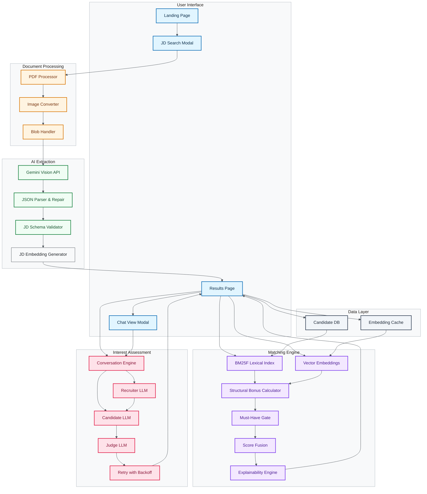

# Architecture Diagram

## Component Overview

### User Interface Layer
- **Landing Page**: Entry point with JD upload modal
- **JD Search Modal**: Multi-step modal for JD parsing and review
- **Results Page**: Displays ranked candidates with match/interest scores
- **Chat View Modal**: Shows conversation transcripts for each candidate

### Document Processing Layer
- **PDF Processor**: Converts PDF pages to images using PDF.js
- **Image Converter**: Renders PDF pages to canvas and extracts blobs
- **Blob Handler**: Manages image blobs for API transmission

### AI Extraction Layer
- **Gemini Vision API**: Extracts structured JSON from images/text
- **JSON Parser & Repair**: Sanitizes and repairs malformed LLM responses
- **JD Schema Validator**: Validates extracted data against schema
- **JD Embedding Generator**: Generates embeddings for job description

### Matching Engine Layer
- **BM25F Lexical Index**: Inverted index for keyword matching
- **Vector Embeddings**: Semantic similarity using cosine similarity
- **Structural Bonus Calculator**: Rewards experience, location, salary, availability
- **Must-Have Gate**: Enforces critical skill requirements
- **Score Fusion**: Combines all signals into match score
- **Explainability Engine**: Generates human-readable explanations via set-diffing

### Interest Assessment Layer
- **Conversation Engine**: Orchestrates two-LLM conversations
- **Recruiter LLM**: Roleplays recruiter, asks questions
- **Candidate LLM**: Roleplays candidate, responds based on profile
- **Judge LLM**: Analyzes transcript to score interest
- **Retry with Backoff**: Handles API rate limits with exponential backoff

### Data Layer
- **Candidate DB**: JSON database of candidate profiles with pre-computed embeddings
- **Embedding Cache**: Cached embedding vectors for faster matching

## Data Flow

1. **JD Upload**: User uploads PDF/image/text → Modal
2. **Document Processing**: PDF → Images → Blobs
3. **AI Extraction**: Blobs → Gemini → Structured JSON
4. **Matching**: JD + Candidate DB → BM25 + Vector + Bonuses → Match Score
5. **Interest Assessment**: Selected candidates → Two-LLM conversations → Interest Score
6. **Combined Scoring**: Match Score (60%) + Interest Score (40%) → Final Ranking
7. **Display**: Results page shows ranked candidates with scores and explanations
